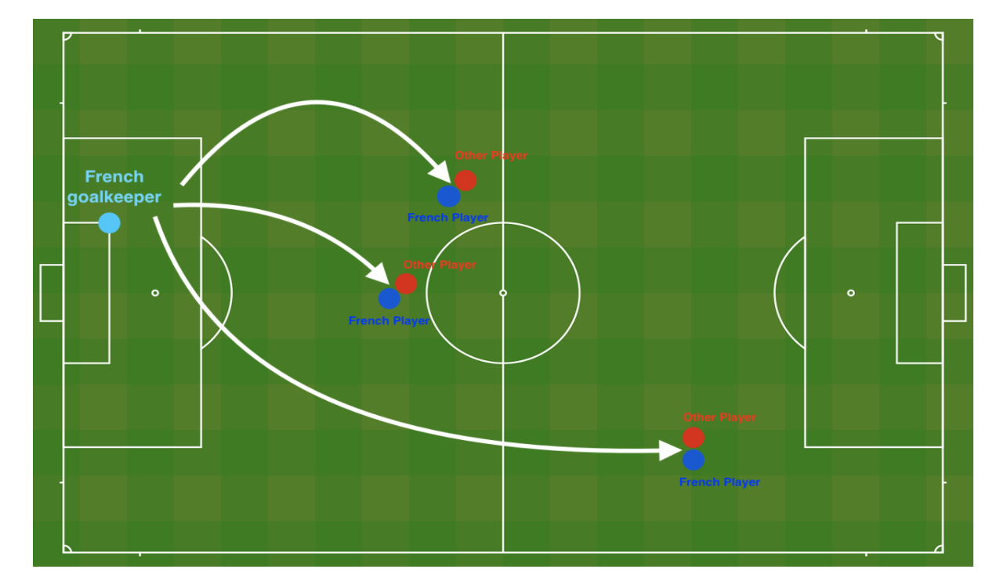

# Deep Learning Project: Preventing Overfitting with L2 Regularization and Dropout
 
This project is part of **Course 2** of the Deep Learning Specialization by Andrew Ng. The goal was to **train a neural network to recommend positions for football players**—specifically focusing on the goalkeeper. But more importantly, the real challenge was to **prevent overfitting** and improve **generalization** of the model using two popular regularization techniques:

- **L2 Regularization**
- **Dropout**

---

## 🛠 What I Built

I implemented a **3-layer deep neural network** (using NumPy only — no high-level frameworks) with the following structure:

1. **Input Layer**
2. **Hidden Layer 1** - ReLU + Dropout
3. **Hidden Layer 2** - ReLU + Dropout
4. **Output Layer** - Sigmoid (for binary classification)

---

## 📸 Visualizing the Game Strategy

Here's a visual snapshot of the kind of data setup or game dynamics our model might try to understand 👇



The blue circles represent **French players**, and the red ones are **opponents**. The model learns from this kind of setup to suggest optimal positions, especially for the **goalkeeper**, under different threat conditions.

---

## 🔍 Key Concepts I Worked On

### ✅ 1. L2 Regularization
- Penalized large weights to prevent the model from overfitting the training data.
- In the **cost function**, I added the L2 penalty term:  
  `L2_cost = (λ / (2 * m)) * sum(W**2)`
- In **backpropagation**, I adjusted gradients like this:  
  `dW += (λ / m) * W`

### ✅ 2. Dropout
- Randomly turned off neurons during training to reduce reliance on specific pathways.
- Applied dropout **only** on hidden layers — not on the input or output.
- Used **inverted dropout**:
  - Created dropout masks: `D = (np.random.rand(...) < keep_prob).astype(int)`
  - Applied masks and scaled the activations: `A *= D`, `A /= keep_prob`
  - During backprop, I did the same for `dA`.

---

## 🔁 Forward Propagation with Dropout
I modified the forward pass to include dropout on the hidden layers:

```python
D1 = (np.random.rand(A1.shape[0], A1.shape[1]) < keep_prob).astype(int)
A1 = (A1 * D1) / keep_prob
